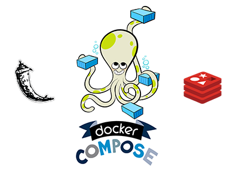

# Docker Compose
## Build with Flask and Redis

## Description

Compose is a tool for defining and running multi-container Docker applications. With Compose, you use a Compose file to configure your application’s services. Then, using a single command, you create and start all the services from your configuration. 

## Getting Started

    git clone https://github.com/fuadajip/docker-compose-sample.git

    cd <dir_name>

## Run
    docker-compose up
    or
    docker-compose up -d

## Stop
    docker-compose stop

## Result Image
Build Proccess

Result

